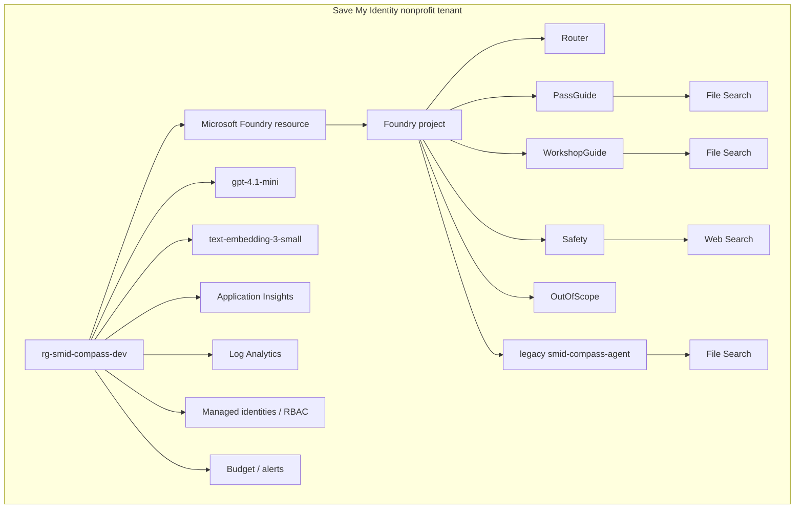
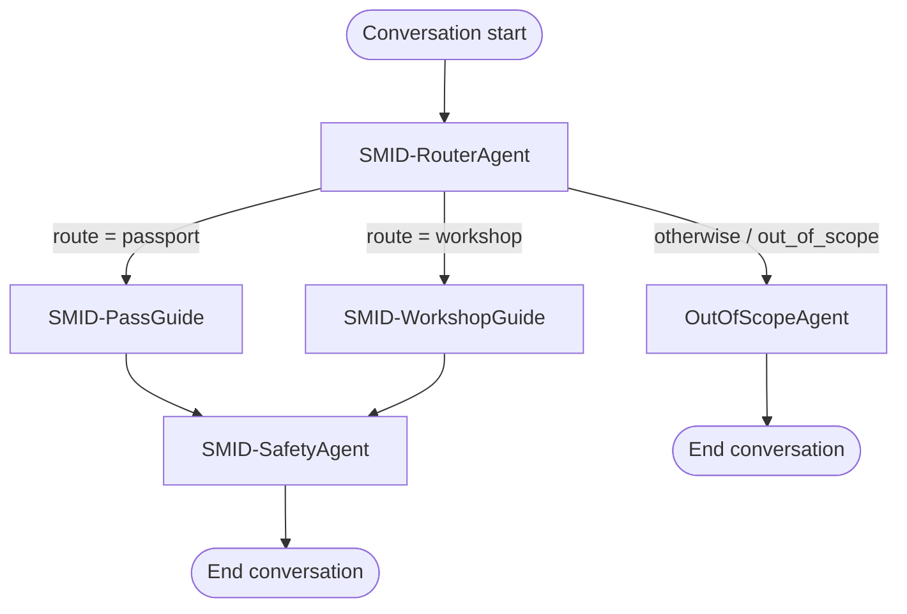

# SMID Compass — Target Migration Architecture v1

Status: Approved for migration planning

Purpose: Reconstruct the frozen SMID Compass source implementation in the Save My Identity nonprofit Azure tenant before any modernization.

Baseline: [source-snapshot-v1](../../source) (finalization commit `90e43db8fcfd934a04a31d752c9b21c5867c8212`)

## Architectural principle

**Migrate first. Validate parity. Modernize later.**

This document describes only the parity-focused reconstruction of the frozen source implementation. It does not redesign the workflow, agents, or prompts. A separate architecture, **Future Modernization Architecture v2**, will be written after a working, validated nonprofit DEV reconstruction exists. Modernization v2 is out of scope for this document and for the current migration implementation.

## Architecture principles

1. Source snapshot (`source-snapshot-v1`) remains immutable.
2. Migration and modernization are separate phases; this phase does not modernize.
3. DEV is deployed before PROD.
4. Preserve source behavior wherever technically possible.
5. Source-specific IDs are never reused.
6. New nonprofit identities and RBAC assignments will be created.
7. Infrastructure should become reproducible through Terraform.
8. Agent/application configuration should remain version controlled.
9. Differences forced by current platform capabilities must be documented explicitly, as migration deviations.
10. Do not introduce new architectural components unless required for migration.

## Target environment

| | |
|---|---|
| Tenant | Save My Identity nonprofit Microsoft/Azure tenant |
| Environment | DEV |
| Resource group (provisional) | `rg-smid-compass-dev` |
| Foundry resource (provisional) | `smid-compass-dev-resource` |
| Foundry project (provisional) | `smid-compass-dev` |

Names are provisional until nonprofit preflight (Phase 2 of the migration plan) confirms naming and regional constraints.

### Region

Prefer `swedencentral` for source parity **if**:

- Microsoft Foundry capability is available
- the required model versions are available
- quota is sufficient
- all required tools are supported

Otherwise choose an appropriate European region and document the deviation in the preflight report.

## Target components — parity scope

### Foundation

- Dedicated DEV resource group
- Microsoft Foundry resource
- Microsoft Foundry project
- Application Insights
- Log Analytics Workspace
- Managed identities
- Target RBAC assignments (least privilege, designed for the nonprofit tenant)
- Budget / cost alerts where appropriate

Historical identity IDs and RBAC assignments from the source tenant are never cloned.

## Model deployments

Source deployment baseline (from `source/azure/deployments/deployments.raw.json`):

| Deployment | Model | Version | SKU / type | Capacity | Format | RAI policy | Version upgrade option |
|---|---|---|---|---|---|---|---|
| `gpt-4.1-mini` | gpt-4.1-mini | 2025-04-14 | GlobalStandard | 50 | OpenAI | Microsoft.DefaultV2 | OnceNewDefaultVersionAvailable |
| `text-embedding-3-small` | text-embedding-3-small | 1 | GlobalStandard | 120 | OpenAI | Microsoft.DefaultV2 | OnceNewDefaultVersionAvailable |

Migration rule: attempt source parity first. Before Terraform deployment, verify in the nonprofit tenant:

- model availability
- model version availability
- regional support
- quota
- capacity constraints

Do not silently substitute models or versions. If a source model/version cannot be recreated, record the required target deviation before deployment.

## Agents — parity scope

Recreate all six exported source agents initially:

1. `SMID-RouterAgent`
2. `SMID-PassGuide`
3. `SMID-WorkshopGuide`
4. `SMID-SafetyAgent`
5. `OutOfScopeAgent`
6. `smid-compass-agent` — **legacy candidate retained for parity/history.** Do not delete it during migration. Do not redesign its role yet.

### Agent tool configuration

Preserve source tool configuration initially:

| Agent | Tools |
|---|---|
| `SMID-RouterAgent` | none |
| `SMID-PassGuide` | File Search |
| `SMID-WorkshopGuide` | File Search |
| `SMID-SafetyAgent` | Web Search |
| `OutOfScopeAgent` | none |
| `smid-compass-agent` | File Search |

Do not remove Web Search from Safety during migration. Whether Safety really needs Web Search is a Modernization v2 decision.

## File Search / knowledge

Preserve the current File Search architecture first. No external Azure AI Search or dedicated external storage account was present in the source snapshot (`source/inventory/source-environment.json`).

`source/inventory/agent-knowledge-mapping.json` is the authoritative migration input for knowledge reconstruction.

Active agent mappings:

| Agent | Tool | Source file memberships |
|---|---|---|
| `SMID-PassGuide` | File Search | 3 |
| `SMID-WorkshopGuide` | File Search | 2 |

Legacy:

| Agent | Tool | Source file memberships |
|---|---|---|
| `smid-compass-agent` | File Search | 8 |

Preserved historical finding: `LOPNA 2015.pdf` has source vector-store status `failed` and is a legacy-agent-only membership. This is a frozen source record and is not altered by migration; target upload/index behavior for this file will be validated separately during Phase 5.

Preserve historical File Search chunking configuration initially:

```
max_chunk_size_tokens: 800
chunk_overlap_tokens: 400
```

All nonprofit uploads will generate **new** file IDs, vector store IDs, and resource IDs. Source `assistant-*` file IDs and `vs_*` vector store IDs are never reused.

## Guardrails

Preserve the custom source policy initially: `SMID-Guardrails-Policy`.

Source custom-policy association (from `source/guardrails/SMID-Guardrails-Policy.json`):

- `SMID-RouterAgent`
- `SMID-PassGuide`
- `SMID-WorkshopGuide`
- `SMID-SafetyAgent`
- `smid-compass-agent`

Source observation: `OutOfScopeAgent` did **not** use the custom policy. Do not change this during parity migration merely to improve consistency — applying the guardrail to `OutOfScopeAgent` is a Modernization v2 question.

Model deployment policy: `Microsoft.DefaultV2`. Revalidate target availability/behavior during deployment.

## Workflow / orchestration

Source workflow behavior to preserve (`source/workflows/SMID-compass-workflow.yaml`):

```
Router
├── passport
│   └── PassGuide
│       └── Safety
│           └── End
│
├── workshop
│   └── WorkshopGuide
│       └── Safety
│           └── End
│
└── otherwise / out_of_scope
    └── OutOfScope
        └── End
```

Known source behavior to preserve:

- Passport passes through Safety.
- Workshop passes through Safety.
- OutOfScope ends directly (does not pass through Safety).
- Safety receives `Coalesce(Local.passport_answer, Local.workshop_answer)`.

Known source mismatch (documented, not fixed during parity migration): `SMID-SafetyAgent`'s instructions expect input in the form `<route> | <answer>`, but the workflow only passes the selected answer text, with no route prefix. Do not fix this during source-parity reconstruction unless current platform limitations make exact recreation impossible. This is recorded as a **known modernization candidate** (see Deferred to Modernization v2 below).

### Current workflow technology

Migration preference: attempt to reproduce the existing source orchestration behavior first. Do not migrate to Microsoft Agent Framework as part of the initial migration unless current Microsoft platform limitations make recreation of the existing workflow impossible.

If exact workflow recreation is blocked by current platform capabilities:

- preserve the same routing and sequencing semantics
- implement only the minimum compatibility replacement necessary
- document it explicitly as a migration deviation
- do not perform broader Agent Framework modernization at the same time

Microsoft Agent Framework migration belongs primarily to Modernization v2.

## Identity and RBAC

All source identities (tenant IDs, subscription IDs, principal IDs, client IDs, agent GUIDs, blueprint IDs, source resource IDs) are historical/non-portable and are never reused. New nonprofit identities are created.

RBAC is designed for the nonprofit tenant under the principle of least privilege. Historical role assignments are not cloned mechanically. Exact target RBAC design is completed during Terraform design (Phase 3 of the migration plan).

## Observability

Create fresh Application Insights and Log Analytics Workspace. Do not clone historical IDs or configuration.

Observability requirements should include:

- DEV debugging
- agent execution visibility
- failures
- latency
- cost awareness

Privacy requirement: SMID Compass may handle user questions involving identity/passport situations. Do not intentionally log unnecessary personal data. Use synthetic test data during DEV validation. Detailed production retention/tracing policy belongs to the production design phase.

## Not included in Target Migration v1

Unless preflight proves they are technically required, do **not** add:

- external Azure AI Search
- dedicated external Storage Account
- Key Vault
- Cosmos DB
- Memory
- MCP
- external API integrations
- fine-tuning
- additional knowledge architecture
- new agents
- production deployment
- redesigned prompts
- Agent Framework modernization

These can be evaluated later, in Modernization v2.

## Architecture diagram



### Workflow diagram



## Deferred to Modernization v2

- Microsoft Agent Framework evaluation/migration
- Workflow redesign
- Safety input mismatch correction (`<route> | <answer>` vs. answer-only input)
- Safety Web Search necessity review
- OutOfScope guardrail consistency (whether to apply `SMID-Guardrails-Policy` to it)
- Legacy agent (`smid-compass-agent`) retirement decision
- Prompt improvements
- Enhanced evaluation
- Observability refinement
- Possible Standard File Search / Azure AI Search, if requirements justify it
- Future SMID Compass modules

None of these are designed in this document.
